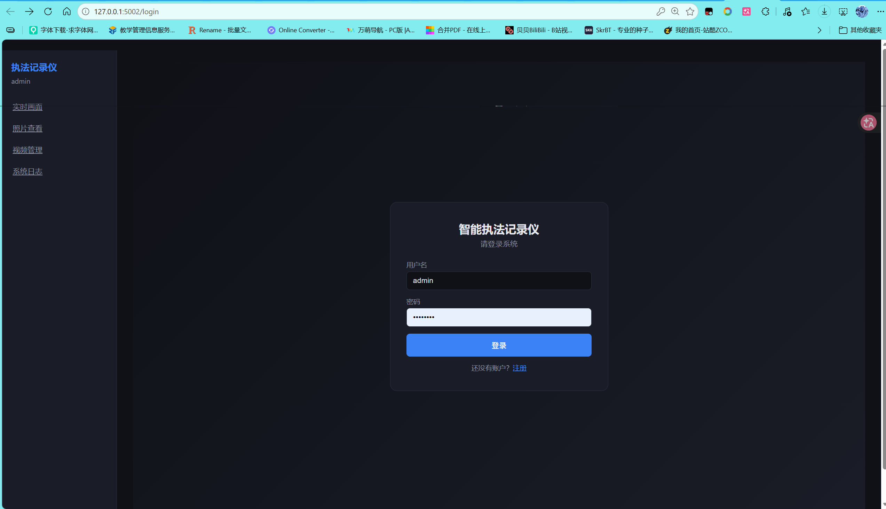
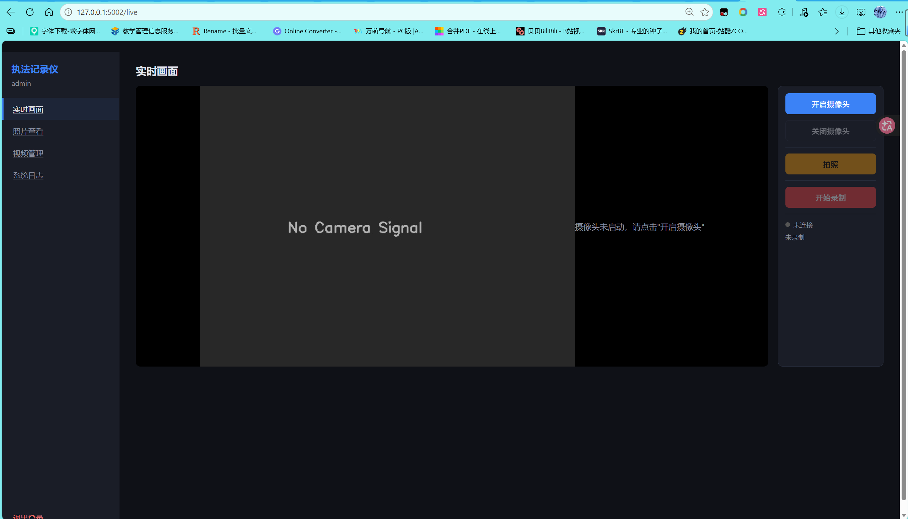

# 智能执法记录仪 (Smart Body Worn Camera)

基于 Flask + OpenCV 的 Web 端智能执法记录仪系统，支持摄像头实时采集、MJPEG 流预览、H.264 视频录制、拍照、视频转码导出等功能。

---

## 快速开始

```bash
cd "Smart Body Worn Camera"
pip install -r requirements.txt
python app.py
```

浏览器打开 `http://127.0.0.1:5002/login`，默认账号 `admin` / `admin123`。



**可选依赖**：FFmpeg（用于视频录制和转码，需在系统 PATH 中）。拍照和实时预览不依赖 FFmpeg。

---

## 功能



| 功能 | 说明 |
|------|------|
| **实时画面** | MJPEG 流显示摄像头画面，录制时叠加红色 REC 指示灯 |
| **拍照** | 一键截取当前帧，保存为 JPEG，支持灯箱放大查看 |
| **视频录制** | H.264 编码录制，采集线程取帧 → 队列 → 编码线程写入 FFmpeg stdin 管道 |
| **视频转码** | H.264 源文件转码导出为 MP4 / AVI / FLV 格式 |
| **视频播放** | 浏览器内直接播放录制的视频 |
| **日志查看** | 记录摄像头开关、拍照、录制、转码、登录登出等操作 |

---

## 项目结构

```
Smart Body Worn Camera/
├── app.py                  # Flask 主应用（路由 + MJPEG 流 + REST API）
├── camera_manager.py       # 摄像头管理器（单例 + 多线程采集/编码）
├── transcoder.py           # FFmpeg 转码模块（H.264 → MP4/AVI/FLV）
├── models.py               # SQLite 数据层（用户/日志/照片/视频）
├── requirements.txt        # Flask + opencv-python + numpy
├── templates/
│   ├── login.html          # 登录/注册
│   ├── live.html           # 实时画面 + 控制面板
│   ├── photos.html         # 照片网格 + 灯箱放大
│   ├── videos.html         # 视频列表 + 播放 + 转码
│   └── logs.html           # 操作日志
├── static/
│   ├── css/style.css       # 暗色执法设备风格
│   └── js/main.js          # 前端交互
├── photos/                 # 拍照输出（gitignore）
├── recordings/             # 录制输出（gitignore）
└── data/                   # SQLite 数据库（gitignore）
```

## 技术架构

| 要求 | 实现 |
|------|------|
| **单例模式** | `CameraManager`、`Database` 双重检查锁定单例 |
| **MVC 模式** | `models.py`(M) / `templates`(V) / `app.py`(C) |
| **多线程** | 采集线程 + 编码线程，`threading.Lock` 保护帧缓冲和队列 |
| **FFmpeg** | 子进程 stdin 管道 H.264 编码，`Transcoder` CLI 转码 |
| **技术难点** | 单线程无法同时解码编码；采集线程 push 帧到队列 → 编码线程 pop 写入 FFmpeg stdin，实现在录制过程中边采集边存储 |

## API 接口

| 方法 | 路由 | 说明 |
|------|------|------|
| `POST` | `/api/login` | 登录 |
| `POST` | `/api/register` | 注册 |
| `GET` | `/api/camera/status` | 摄像头状态 |
| `POST` | `/api/camera/start` | 开启摄像头 |
| `POST` | `/api/camera/stop` | 关闭摄像头 |
| `POST` | `/api/camera/photo` | 拍照 |
| `POST` | `/api/camera/record/start` | 开始录制 |
| `POST` | `/api/camera/record/stop` | 停止录制 |
| `GET` | `/video_feed` | MJPEG 视频流 |
| `GET` | `/api/photos` | 照片列表 |
| `GET` | `/api/videos` | 视频列表 |
| `POST` | `/api/videos/<id>/transcode` | 转码 |
| `GET` | `/api/logs` | 操作日志 |

## 常见问题

**Q: 摄像头打开很慢？**
A: 已使用 DSHOW 后端（`cv2.CAP_DSHOW`），Windows 上秒开。如果仍然慢，检查是否有其他程序占用摄像头。

**Q: 录制失败？**
A: 需要 FFmpeg 在系统 PATH 中。下载地址：https://ffmpeg.org/download.html

**Q: 数据在哪里？**
A: SQLite 数据库在 `data/camera.db`，照片在 `photos/`，视频在 `recordings/`。删除 `.db` 文件后重启会自动重建。
